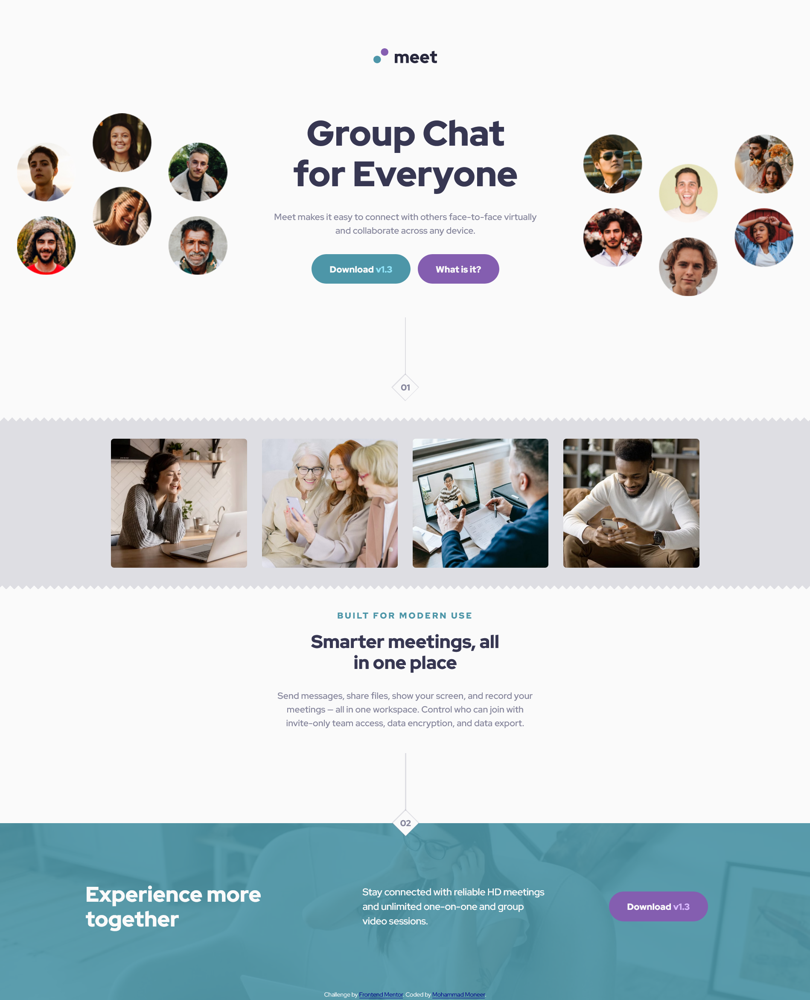
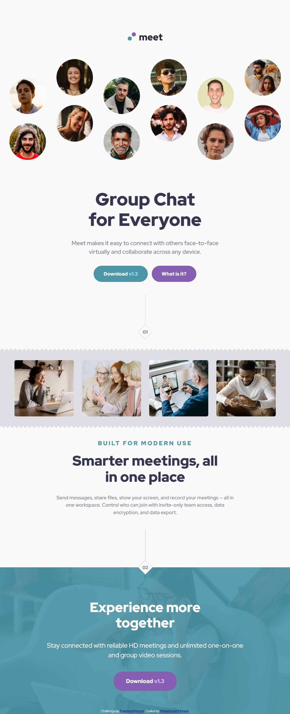

# Frontend Mentor - Meet landing page solution

This is a solution to the [Meet landing page challenge on Frontend Mentor](https://www.frontendmentor.io/challenges/meet-landing-page-rbTDS6OUR). Frontend Mentor challenges help you improve your coding skills by building realistic projects.

## Table of contents

- [Overview](#overview)
  - [Screenshot](#screenshot)
  - [Links](#links)
- [My process](#my-process)
  - [Built with](#built-with)
  - [New Skills and Knowledge Gained from This Project](#new-skills-and-knowledge-gained-from-this-project)
- [Author](#author)

## Overview
To get some details and background of this project visit the link below:
[Frontend Mentor | Meet landing page challenge](https://www.frontendmentor.io/challenges/meet-landing-page-rbTDS6OUR)

### Screenshot

Desktop version

Tablet version

Mobile version

### Links

- [GitHub Repository](https://github.com/Mohammad-Moneer/meet-landing-page)
- [Live Demo](https://mohammad-moneer.github.io/meet-landing-page/)

## My process

### Built with

- HTML
- CSS
- Grid
- Flex
- BEM naming convention

### New Skills and Knowledge Gained from This Project

- auto-fit in CSS Grid:
I used auto-fit in grid-template-columns: repeat(auto-fit, minmax(...)) to make the grid adapt to the available space.
I learned that auto-fit automatically adjusts the number of columns based on the container width, and stretches the items to fill the row.

## Author

- Frontend Mentor - [@Mohammad-Moneer](https://www.frontendmentor.io/profile/Mohammad-Moneer)